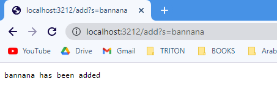
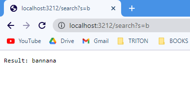
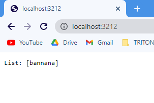

# Lab Report 2 #
## **Simplest Search Engine Code**

```

class Handler implements URLHandler {
    // The one bit of state on the server: a number that will be manipulated by
    // various requests.
    ArrayList<String> groceries = new ArrayList<String>();
    int num = 0;

    public String handleRequest(URI url) {
        if (url.getPath().equals("/")) {
            return String.format("List: %s", groceries);
        } else if (url.getPath().equals("/search")) {
            String[] parameters1 = url.getQuery().split("=");
            if(parameters1[0].equals("s")){
                for(int i = 0; i<groceries.size(); i++){
                    if(groceries.get(i).contains(parameters1[1])){
                        return String.format("Result: %s", groceries.get(i));
                    }
                    else{
                        return String.format("Not found");
                    }
                }
                }
            
            //num += 1;
            //return String.format("Searched");
        } else {
            System.out.println("Path: " + url.getPath());
            if (url.getPath().contains("/add")) {
                String[] parameters2 = url.getQuery().split("=");
                if (parameters2[0].equals("s")) {
                    groceries.add(parameters2[1]);
                    return String.format("%s has been added", parameters2[1]);
        
                }
            }
            //return "404 Not Found!";
        }
        return "404 Not Found!";
    }
    
```
---
## Search Engine Demonstration 
---


### **The method add is called and the parameter in the url is attributed to the letter s. The object after it is the string that will be added to the Array List.** 
#
### **The Path is delineated by the / symbol. This allows us to create multiple paths that essentially allow us to create method calls that take in parameters and return results**
#

### **As we can see with the search function we do not need to type out an entire item as all the method checks for is whether the letter "b" is contained in the string.** 
#

### **The current list with only one addition**

