# Lab Report 3 # 

### The less command shows the contents of a file one screen at a time and is able to scroll through using certain keys
<br><br>
The syntax for the less command 
### 
```
less <file-name>
```
<br>

## **Three command options with exammples**

### 1) The first command option that will be demonstrated is the -N option

### It enumerates the results by line which is helpful considering that most times in terminal the lines are not enumerated. This makes scrolling though results much more practical 

```
less -N <file-name>
```

### An example of the -N option used on the technical directory search results for .txt files. 

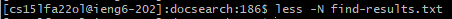
 
 ### The command typed 

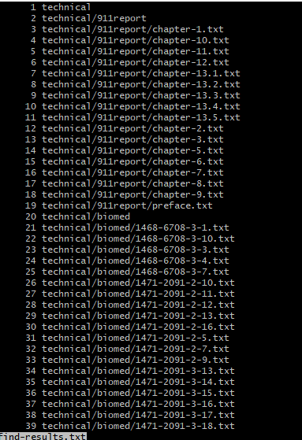

### The first page of results

### After pressing the space button it will increment by the number of results shown on the screen. 

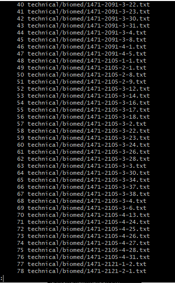

### To exit simply press the q key:
```
q
```

### 2) The second command option is done within the contents of a file shown by the command less. Simply type 
```
/<search-term>
```

#### The term will be highlighted if found

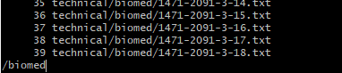 

### After pressing enter

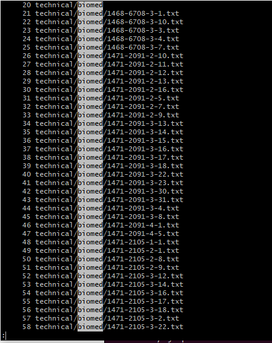

### It highlights the search results 

<br>

### Another example 
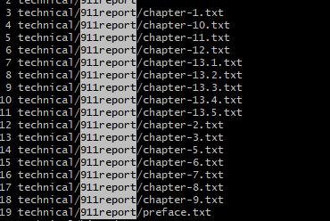

### Final Example 

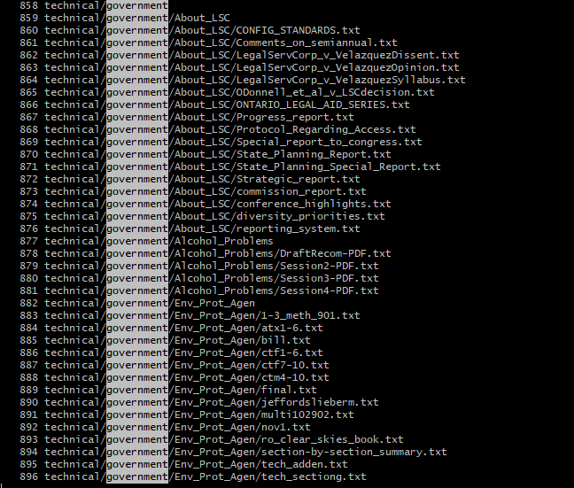

### 3) The -X command 

### The -X command keeps the content on the terminal screen even after quitting. 


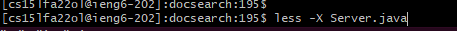

### The highlighted file on the bottom indicates that we are still in the file 

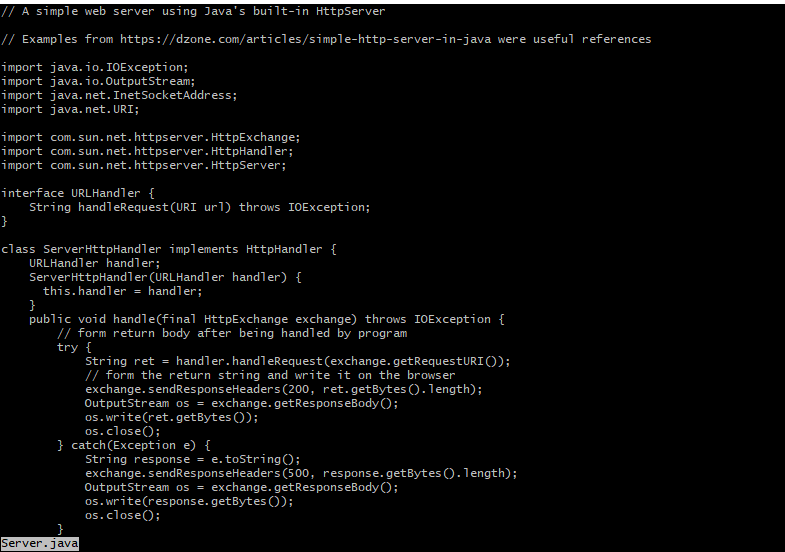

### Even after quitting and typing in another command and viewing the contents of another file and exiting out the file above is still visible 

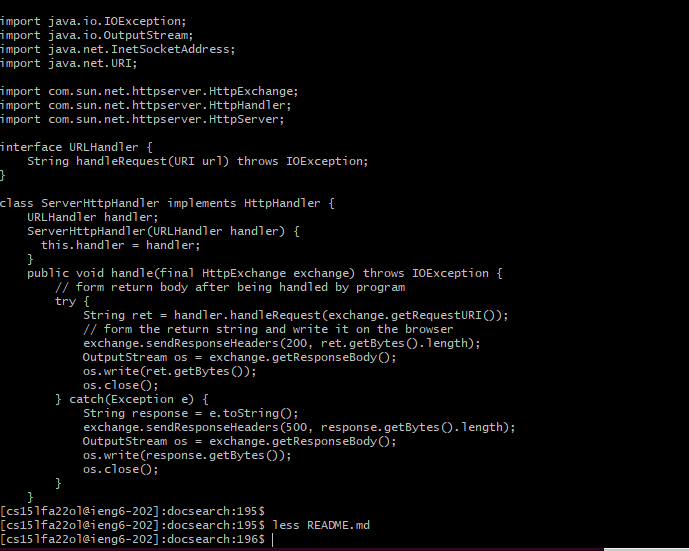

### As shown, less README.md was entered and quitted and we still see the contents of Server.java

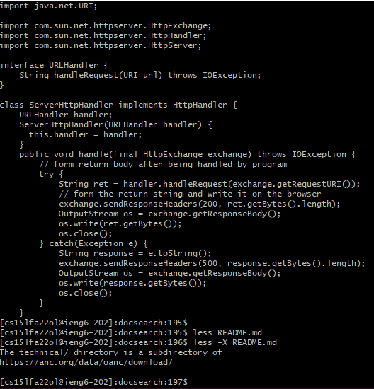

### After -X for README.md we can still see the contents of Server.java and README.md


